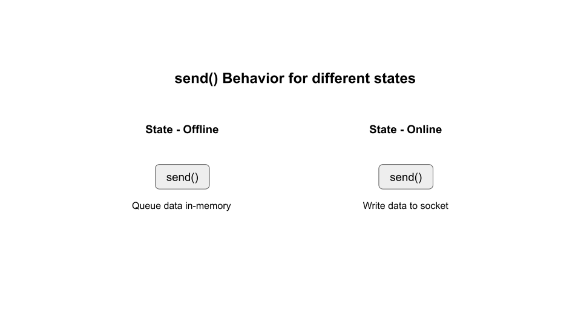
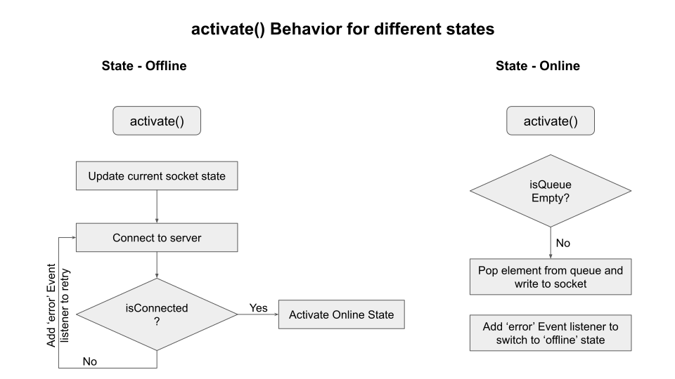

### Contents
- [Objective](#objective)
- [Run code](#run-code)
- [What I learnt?](#what-i-learnt)
- [TODO](#todo)
- [References](#references)

## Objective

Build a wrapper around TCP Client Socket which queues data in-memory if it loses connection to the server. When it reconnects to the server it sends the queued data

## Run code

`DEBUG=all:state-pattern:* nodemon index.js` To start the client publishing memory data on server

`DEBUG=all:state-pattern:* nodemon tcp-server.js` To start the server

## What I learnt?

The state pattern can be implemented by identifying

1. Behavior that will differ across states

   In `FailsafeSocket` the `send` method is implemented across both the online and the offline state. When online, the data is written to the socket; when offline, the data is queued in an array.

   

2. Behavior that is executed on transition to a state

   In `FailsafeSocket` the transition behavior is implemented in the `activate` method for each state

   

   When state transitions to `offline`, the FailsafeSocket retries until it gets a successful connection.

   When state transitions to `online`, the FailsafeSocket checks to push any queued data to the server

3. Objects required by different states
   
   In `FailsafeSocket` the following data is shared across states
   
   1. `queue` - Storing data to be sent on a successful connection
   2. `socket` - Stores the connection socket
   3. `currentState` - Stores the current state to allow executing state specific `send` behavior

4. Implement a method to switch state

   In `FailsafeSocket` `changeState` is used to switch between online and offline states

## TODO

[ ] Implement Exponential backoff when retrying for a connection

## References

1. [NodeJS Design Patterns by Mario Casciaro](https://www.amazon.in/Node-js-Design-Patterns-Mario-Casciaro/dp/1785885588)